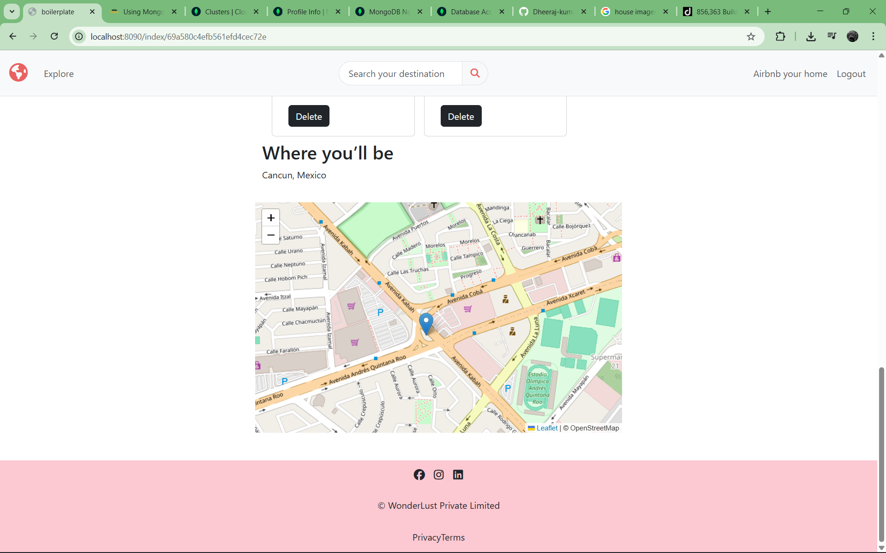
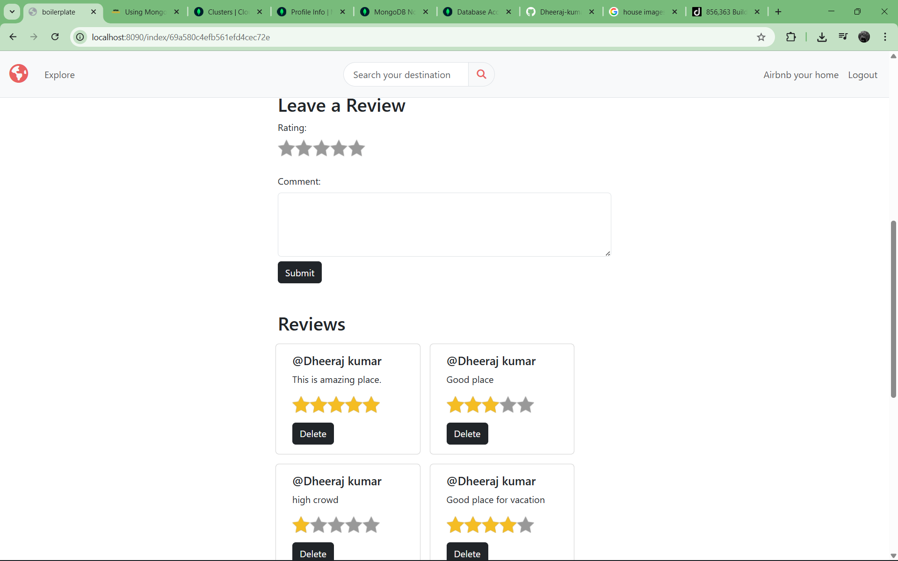
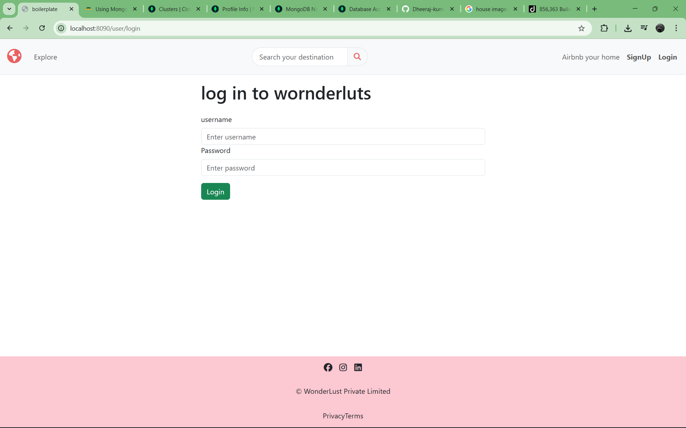

# SkyBugs – Property Listing Platform

SkyBugs is a web-based property listing platform where users can create, update, and manage property listings. It includes authentication, authorization, and a basic map-based location system.

This project focuses on core backend functionality and real-world CRUD operations.

---

## Features

* Create, update, and delete property listings (CRUD)
* Map-based property location (geographical integration)
* User authentication & authorization
* Comment system on listings
* Image upload support
* Server-side rendering using EJS

---

## 🛠️ Tech Stack

**Frontend:**

* EJS (Embedded JavaScript Templates)
* CSS / Bootstrap

**Backend:**

* Node.js
* Express.js

**Database:**

* MongoDB

**Other:**

* Authentication (Passport / Sessions)
* Map integration (e.g., Mapbox / Leaflet)

---

## Project Structure

SkyBugs/
│── models/         # Database schemas
│── routes/         # Routes
│── controllers/    # Logic
│── views/          # EJS templates
│── public/         # Static files (CSS, JS)
│── utils/          # Helper functions
│── index.js          # Main server file
│── README.md

## ⚙️ Installation & Setup

1. Clone the repository

git clone https://github.com/Dheeraj-kumar01/skybugs

2. Install dependencies

npm install

3. Start the server

node index

---

## 📸 Preview

---

## 🎯 Future Improvements

* Payment integration
* Responsive UI improvements
* Rating system
* Advanced filtering

## 👨‍💻 Author

**Dheeraj Kumar**
BCA Student | Web Developer

